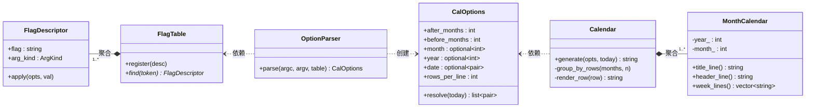
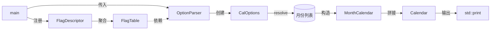

# minical 设计文档

## 项目结构

```
minical/
├── CMakeLists.txt                # 顶层构建
├── cmake/
│   └── SetupDependencies.cmake   # FetchContent 依赖管理
├── 3rd/                          # 第三方源码包（离线构建用）
├── src/
│   ├── main.cpp                  # 入口：组装 flag 表、解析、渲染
│   ├── cal_options.hpp/cpp       # 选项数据 + resolve()
│   ├── flag_descriptor.hpp/cpp   # flag 元数据 + apply 回调
│   ├── flag_table.hpp/cpp        # flag 注册容器
│   ├── option_parser.hpp/cpp     # 命令行解析
│   ├── month_calendar.hpp/cpp    # 单月月历生成
│   └── calendar.hpp/cpp          # 多月编排与渲染
└── test/
    ├── test_month_calendar.cpp
    ├── test_option_parser.cpp
    ├── test_cal_options.cpp
    └── test_integration.cpp
```

## 类图



## 各类职责

| 类 | 职责 |
|----|------|
| FlagDescriptor | 描述 flag 的元数据：名称、参数类型、写入回调。本质上是策略模式中的一个策略 |
| FlagTable | 存储所有 FlagDescriptor，按名称查找。不加新 flag 则不改 |
| OptionParser | 遍历 argv，查表、取参、委托 apply()。不感知具体 flag |
| CalOptions | 纯数据结构，存储解析结果。`resolve()` 是唯一将选项展开为 (年,月) 列表的地方 |
| MonthCalendar | 单月文本块：标题行、星期表头、4–6 行日期（Tomohiko Sakamoto 算法计算星期） |
| Calendar | 将月份列表按排分组、横向拼接成最终输出 |

## 类关系图



| 关系 | 说明 |
|------|------|
| FlagDescriptor → FlagTable | 聚合 — FlagTable 持有 FlagDescriptor |
| OptionParser → FlagTable | 依赖 — 接收 FlagTable 参数，仅调用 `find()` |
| OptionParser → CalOptions | 创建 — `parse()` 过程中构造并返回 |
| Calendar → MonthCalendar | 聚合 — 1 对多 |
| Calendar → CalOptions | 依赖 — 接收 CalOptions 参数 |

## 用例图


| 用例 | 描述 |
|------|------|
| 解析命令行参数 | 识别 `-A` `-B` `-d` `-r` `-m` `yyyy`，非法输入报错到 stderr |
| 确定显示范围 | 根据参数计算出需要渲染的 (年, 月) 列表，处理跨年 |
| 生成月历 | 对每个月生成标题、表头、日期行，多个月横向拼接 |
| 输出结果 | 将最终字符串输出到 stdout |

## 核心算法

### 月份偏移（`add_months`）

```cpp
// 将 (年, 月) 偏移 delta 个月，支持负数
// 例：add_months({2025, 1}, -1) → {2024, 12}
// 例：add_months({2025, 12}, 1) → {2026, 1}
```

通过纯算术运算实现跨年月份的加减，无循环、无分支枚举。

### 星期计算（Tomohiko Sakamoto 算法）

使用 Sakamoto 魔数表 `t = [0, 3, 2, 5, 0, 3, 5, 1, 4, 6, 2, 4]`，O(1) 计算出每月 1 号的星期几，支持 1–9999 年内任意日期。

## SOLID 原则

| 原则 | 体现 |
|------|------|
| **S** 单一职责 | 6 个类各司其职：解析（OptionParser）、存储（FlagTable）、数据（CalOptions）、单月渲染（MonthCalendar）、编排（Calendar）、元数据（FlagDescriptor） |
| **O** 开闭 | 加新参数只需 `register_flag()` 一行；扩展 Calendar 不改 MonthCalendar；增加渲染格式不改解析逻辑 |
| **L** 里氏替换 | 未涉及继承。FlagDescriptor 的 `apply` 回调本质上是策略模式，不同策略可互相替换 |
| **I** 接口隔离 | FlagTable 仅暴露 `find` / `register`；MonthCalendar 仅暴露三个渲染方法；CalOptions 仅暴露字段 + `resolve()` |
| **D** 依赖倒置 | OptionParser 依赖 FlagTable 接口而非具体 flag；Calendar 依赖 MonthCalendar 接口而非内部实现；`main()` 在顶层组装 |

## 批评性分析

### 优点

- **FlagDescriptor 策略模式**：参数抽象为"名称 + 类型 + 回调"，解析循环约 30 行，新增参数不改循环
- **单月与多月分离**：MonthCalendar 和 Calendar 各自独立可测试
- **离线构建**：`3rd/` 目录存放依赖 zip 包，无需网络即可编译
- **现代 C++**：使用 `std::optional`、`std::expected`（解析）、`std::format`、`std::print`、`std::chrono` 等 C++20/23 特性

### 不足

| 问题 | 说明 |
|------|------|
| `-m` 与 `-d` 优先级 | 设计规定 `-m` 优先于 `-d` 的 month 部分，但直觉上 `-d` 更具体，应该胜出。更好的做法是"后出现的覆盖先出现的" |
| 仅支持公历 | 闰年规则和月份天数硬编码，如需扩展农历应抽象日期计算接口 |
| 无帮助输出 | 不支持 `-h` / `--help`，用户只能通过阅读源码或文档了解参数 |
| 硬编码英文 | 月份名和星期表头无本地化支持 |

## 参考资料

- [1] OOD — https://zh.wikipedia.org/wiki/面向对象程序设计
- [2] SOLID — https://de.wikipedia.org/wiki/Solid
- [3] Tomohiko Sakamoto 算法 — Sakamoto, T. "Day-of-week algorithm", 1993
