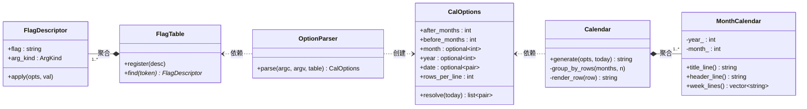
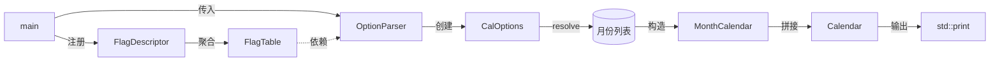

# lab7 cal 命令的面向对象实现

## 项目结构

```
minical/
├── CMakeLists.txt
├── readme.md
├── src/
│   ├── main.cpp                 # 入口
│   ├── cal_options.hpp/cpp      # 选项数据 + resolve()
│   ├── flag_descriptor.hpp/cpp  # flag 元数据
│   ├── flag_table.hpp/cpp       # flag 容器
│   ├── option_parser.hpp/cpp    # 命令行解析
│   ├── month_calendar.hpp/cpp   # 单月月历
│   └── calendar.hpp/cpp         # 多月编排
└── test/
    ├── test_month_calendar.cpp
    ├── test_option_parser.cpp
    ├── test_cal_options.cpp
    └── test_integration.cpp
```

## 构建与运行

```bash
cmake -S . -B build -DCMAKE_BUILD_TYPE=Release
cmake --build build

# 示例
./build/cal 2025          # 显示 2025 全年，每排 3 个月
./build/cal -m 5          # 显示今年 5 月
./build/cal -A 2          # 显示当月及之后 2 个月
./build/cal -B 2          # 显示当月及之前 2 个月
./build/cal -r 4 2025     # 显示 2025 全年，每排 4 个月

./build/cal_test          # 运行测试（GTest）
ctest --test-dir build     # 或用 ctest 运行
```

## 支持的参数

| 参数 | 说明 | 默认值 |
|------|------|--------|
| `-A N` | 之后 N 个月（不含当前月） | 0 |
| `-B N` | 之前 N 个月（不含当前月） | 0 |
| `-d yyyy-mm` | 指定日期 | 当天 |
| `-r N` | 每排显示月数 | 3 |
| `-m N` | 指定月份（1-12） | 当月 |
| `yyyy` | 位置参数，指定年份 | 当年 |

---

## 1. 类图



### 各类职责

| 类 | 职责 |
|----|------|
| FlagDescriptor | 描述 flag 的元数据：名称、参数类型、写入回调 |
| FlagTable | 存储所有 FlagDescriptor，按名称查找 |
| OptionParser | 遍历 argv，查表、取参、委托 apply()，不感知具体 flag |
| CalOptions | 存储解析结果，resolve() 将选项展开为 (年,月) 列表 |
| MonthCalendar | 生成单月文本块：标题行、星期表头、4-6 行日期 |
| Calendar | 将月份列表按排分组、横向拼接成最终输出 |

---

## 2. 类关系图



| 关系 | 说明 |
|------|------|
| FlagDescriptor → FlagTable | 聚合 — FlagTable 持有 FlagDescriptor |
| OptionParser → FlagTable | 依赖 — 接收 FlagTable 参数，仅调用 find() |
| OptionParser → CalOptions | 创建 — parse() 过程中构造并返回 |
| Calendar → MonthCalendar | 聚合 — 1 对多 |
| Calendar → CalOptions | 依赖 — 接收 CalOptions 参数 |

---

## 3. 用例图


| 用例 | 描述 |
|------|------|
| 解析命令行参数 | 识别 -A -B -d -r -m yyyy，非法输入报错到 stderr |
| 确定显示范围 | 根据参数计算出需要渲染的 (年, 月) 列表，处理跨年 |
| 生成月历 | 对每个月生成标题、表头、日期行，多个月横向拼接 |
| 输出结果 | 将最终字符串输出到 stdout |


---

## 4. SOLID 原则

| 原则 | 体现 |
|------|------|
| S | 6 个类各司其职，没有上帝类或大函数 |
| O | 加新参数只需 register_flag()，不改 OptionParser；扩展 Calendar 不改 MonthCalendar |
| L | 未涉及继承。FlagDescriptor 的 apply 回调本质上是策略模式 |
| I | FlagTable 仅暴露 find/register；MonthCalendar 仅暴露三个渲染方法 |
| D | OptionParser 依赖 FlagTable 抽象，Calendar 依赖 MonthCalendar 接口 |

---

## 5. 批评性意见

### 优点

- FlagDescriptor 将参数抽象为"名称 + 类型 + 回调"，解析循环约 30 行，加参数不改循环。
- 单月生成与多月编排分离，各自可独立测试。

### 不足

| 问题 | 说明 |
|------|------|
| -m 与 -d 优先级 | 设计规定 -m 优先于 -d 的 month 部分，但直觉上 -d 更具体，应该胜出。更好的做法是"后出现的覆盖先出现的" |
| 仅支持公历 | 闰年规则和月份天数硬编码，如需扩展农历应抽象日期计算接口 |

---

## 6. 参考资料

- [1] OOD — https://zh.wikipedia.org/wiki/面向对象程序设计
- [2] SOLID — https://de.wikipedia.org/wiki/Solid
